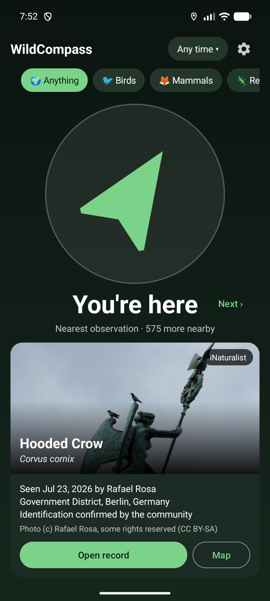
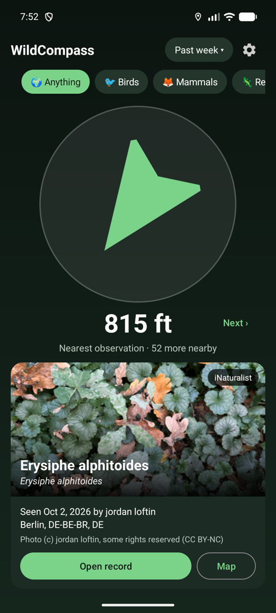

# WildCompass

An Android compass that points to the nearest wildlife observation someone has shared with a
photo. It shows the picture, what it is, when and by whom it was seen, and a link to the
original record.

 

**[Download the latest APK](https://github.com/Unpiloted0852/WildCompass/releases/latest)**

Coffee: https://ko-fi.com/unpiloted0852

## What it does

- Finds the nearest photographed observation on [iNaturalist](https://www.inaturalist.org) and
  in the datasets published through [GBIF](https://www.gbif.org) (Observation.org, Pl@ntNet,
  national atlases and others).
- Filters: anything, birds, mammals, reptiles, amphibians, fish, insects, spiders, snails and
  shells, plants, fungi; and any time, past year, past month or past week.
- **Next** moves on to the next-nearest record, **Back** returns.
- **Open record** opens the original observation page; **Map** opens the spot in a maps app.
- The screen stays on while the app is open.
- Tap the photo to see it full screen: pinch or double-tap to zoom, swipe for the record's
  other photos.

## Things worth knowing

- A record marks where something was seen once, not where it is now.
- Records whose location was deliberately hidden (threatened species, or the observer's
  choice) are left out, as are records with a position error above 500 m, captive animals and
  cultivated plants, and museum specimens.
- GBIF republishes iNaturalist's research-grade records; those are taken from iNaturalist
  directly and skipped in GBIF, so nothing shows up twice.
- Neither API can sort by distance. `NearestFinder.kt` widens the search circle when it is
  empty and shrinks it when it holds more than one page, which usually takes two requests per
  source.
- No API keys are needed. Each photo belongs to its photographer and is shown with the credit
  and licence the source gives.

## Building

Open the folder in Android Studio, or run:

```bash
./gradlew assembleDebug
```

Release signing is read from an untracked `keystore.properties` in the project root
(`storeFile`, `storePassword`, `keyAlias`, `keyPassword`); without it the release build is
left unsigned.

## Updates

The app checks this repository's GitHub Releases at launch. If a newer version is published,
an "Update available" pill appears at the top; one tap downloads the APK and hands it to
Android's installer. The update closes the app, and Android does not let an app reopen
itself, so it is opened again by hand. To ship an update: bump `versionCode` and `versionName`, build a release
APK signed with the same key, and publish a GitHub release tagged `v<versionName>` with the
APK attached.

Not affiliated with iNaturalist or GBIF.
